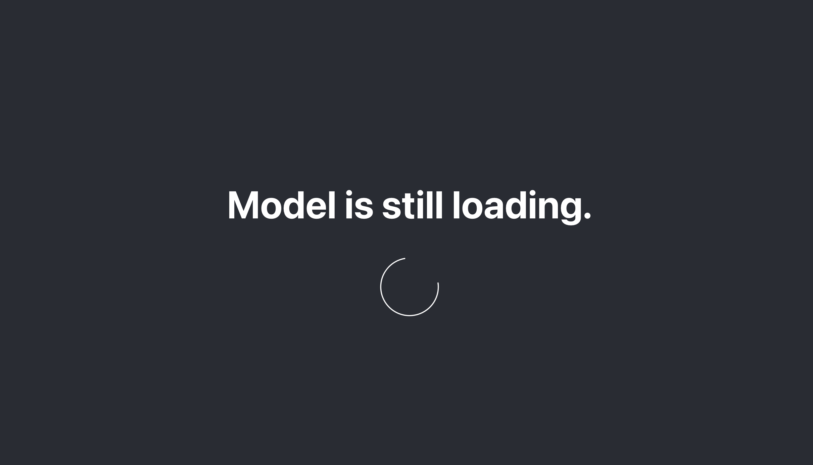
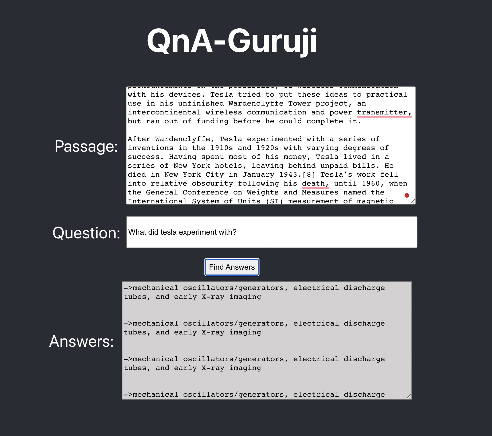

# QnA-Guruji 🔥🐱

A project built with **react** on the UI and **TensorflowJS** to provide a conextual based QnA application.
The QnA algorithm used is BERT QnA model from tensorflow open source models.

## Live Demo Link 🚀

### `https://qna-guruji.vercel.app`

## Available Scripts

In the project directory, you can run the following commands to run the project:

- Install dependencies: `npm install`

- Run the project: `npm start`

## Image Samples:

### Loading Screen (Spinner UI)

### A Sample from nikola tesla wiki and asking a question from the context of the passage -

